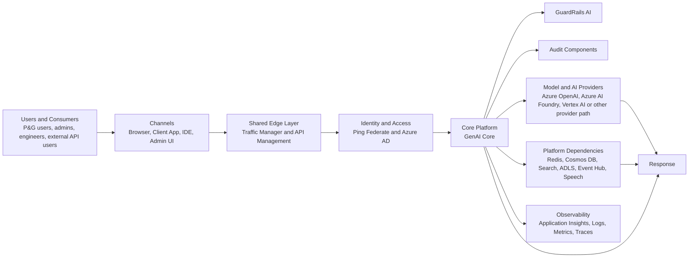
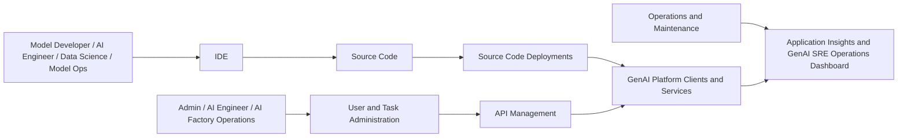
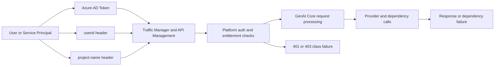
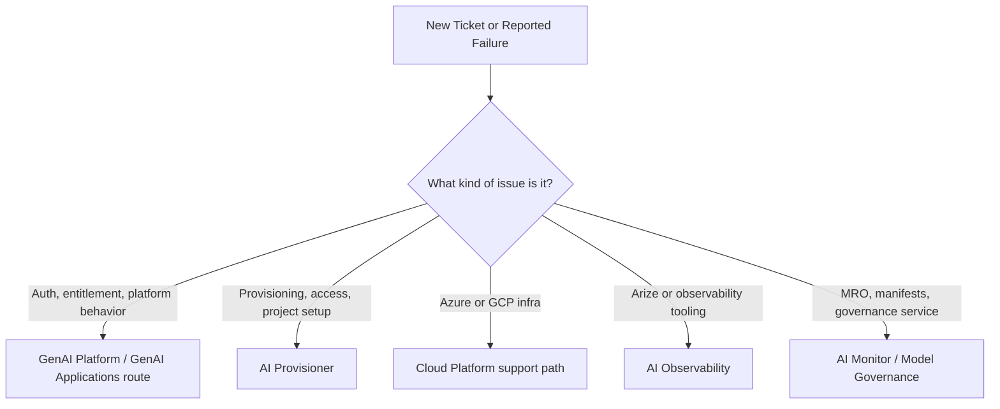

# GenAI Platform End-To-End Onboarding

This guide starts with Day 1, but it is meant to take you through the first full onboarding cycle for GenAI Platform as an AIE SRE. The goal is not just familiarity. The goal is that you can classify issues correctly, use the right operational surfaces, understand how requests flow through the platform, and know when the problem belongs to platform access, auth, connectivity, dependency layers, governance, or another team.

## Scope And Source Of Truth

This Day 1 guide is aligned to:

- The four diagrams in this folder:
  - [GenAI (Artificial Intelligence) Platform Application Environment Diagram - Reference Architecture.drawio.png](./GenAI%20%28Artificial%20Intelligence%29%20Platform%20Application%20Environment%20Diagram%20-%20Reference%20Architecture.drawio.png)
  - [GenAI (Artificial Intelligence) Platform Application Environment Diagram.drawio.png](./GenAI%20%28Artificial%20Intelligence%29%20Platform%20Application%20Environment%20Diagram.drawio.png)
  - [GenAI (Artificial Intelligence) Platform Technical Infrastructure Diagram - Reference Architecture.drawio.png](./GenAI%20%28Artificial%20Intelligence%29%20Platform%20Technical%20Infrastructure%20Diagram%20-%20Reference%20Architecture.drawio.png)
  - [GenAI (Artificial Intelligence) Platform Technical Infrastructure Diagram.drawio.png](./GenAI%20%28Artificial%20Intelligence%29%20Platform%20Technical%20Infrastructure%20Diagram.drawio.png)
- Official AI Factory documentation:
  - GenAI Platform overview
  - GenAI Platform access guide
  - Auth options
  - Available models
  - Non-prod Swagger
  - Prod Swagger
- AIE onboarding and operations anchors:
  - GenAI Platform AI Assistant page
  - GenAI SRE Operations Dashboard

LeanIX is intentionally excluded from this guide.

## Quick Links

Use these as your Day 1 launch points.

### Learning And Documentation

- GenAI site: https://pgone.sharepoint.com/sites/GenAI/
- GenAI Platform overview: https://developerportal.pg.com/docs/default/component/ai_factory_general/generative/genai_platform/
- GenAI project types: https://developerportal.pg.com/docs/default/component/ai_factory_general/generative/genai_platform/reference/genai-project-types
- Available GenAI org projects: https://developerportal.pg.com/docs/default/component/ai_factory_general/generative/genai_platform/reference/available-genai-org-projects
- Provision GenAI access and resources: https://developerportal.pg.com/docs/default/component/ai_factory_general/provisioning/how-tos/provision_genai_access_and_resources
- GenAI Platform access guide: https://developerportal.pg.com/docs/default/component/ai_factory_general/generative/genai_platform/how_tos/genai-platform-access
- Auth options: https://developerportal.pg.com/docs/default/component/ai_factory_general/generative/genai_platform/how_tos/auth-options
- GenAI token: https://developerportal.pg.com/docs/default/component/ai_factory_general/generative/genai_platform/reference/genai_token
- AAD token generation: https://developerportal.pg.com/docs/default/component/ai_factory_general/generative/genai_platform/reference/aad-token-generation
- API endpoints reference: https://developerportal.pg.com/docs/default/component/ai_factory_general/generative/genai_platform/reference/api-endpoints
- Available models: https://developerportal.pg.com/docs/default/component/ai_factory_general/generative/genai_platform/reference/available-models
- PII handling: https://developerportal.pg.com/docs/default/component/ai_factory_general/generative/genai_platform/how_tos/handle-pii-data
- Content filters: https://developerportal.pg.com/docs/default/component/ai_factory_general/generative/genai_platform/how_tos/set-content-filters
- Network connectivity guide: https://developerportal.pg.com/docs/default/component/ai_factory_general/generative/genai_platform/reference/genai-network-connectivity-guide
- SDDE: https://developerportal.pg.com/docs/default/component/ai_factory_general/generative/genai_platform/reference/sdde
- SRE communications: https://developerportal.pg.com/docs/default/component/ai_factory_general/generative/genai_platform/reference/sre_communications
- Non-prod Swagger: https://genai-platform-dev.pg.com/stg/docs
- Prod Swagger: https://genai-platform.pg.com/docs

### Operations And Access

- GenAI Platform AI Assistant: https://jira-pg-ds.atlassian.net/wiki/spaces/AAA/pages/5675876364/GenAI+Platform+-+AI+Assistant
- TURING GenAI Platform section: https://jira-pg-ds.atlassian.net/wiki/spaces/TURING/pages/4197351513/GenAI+Platform
- AIE new hire onboarding landing page: https://jira-pg-ds.atlassian.net/wiki/spaces/AAA/pages/5845614708/New+Hire+s+onboarding+AI+SRE+Operation+Body+of+Knowledge
- GenAI SRE Operations Dashboard: https://grafana.spyglass.pg.com/d/cdpd6za6gtptsd/genai-sre-operations-dashboard
- ITAccess: https://itaccess.pg.com/identityiq/home.jsf
- IdentityCentral: https://identitycentral.pg.com
- GenAI Platform repository: https://github.com/procter-gamble/de-cf-genai-platform

## Suggested Timeline

Use this as the default first-pass onboarding sequence.

| Day | Focus | Outcome |
|---|---|---|
| Day 1 | Mental model, architecture, access surfaces, environment split | You can explain how the platform is layered and where to start triage |
| Day 2 | Auth, headers, project model, provider differences, request anatomy | You can reason about request failures without guessing |
| Day 3 | Connectivity, governance, observability, incidents, ownership, repo anchors | You can route and triage tickets like an SRE instead of a general user |

## Day 1 Outcome

By the end of Day 1, you should be able to explain:

1. What the GenAI Platform is responsible for.
2. Which user types and client channels interact with it.
3. Where requests enter the platform.
4. Where authentication and policy enforcement happen.
5. What the difference is between external-facing and internal platform layers.
6. Why dev, non-prod, and prod must be treated as separate operational surfaces.
7. Where to look first when access, auth, or request issues appear.

## The Platform In One Working Definition

GenAI Platform is the governed enterprise layer that exposes generative AI capabilities to P&G users, administrators, engineers, and selected external consumers through shared entry points such as Traffic Manager and API Management, then routes requests into core platform services, guardrails, audit components, model providers, and supporting data or observability services.

## What The Provided Diagrams Are Actually Showing

### 1. Application Environment Reference Architecture

This is the generic logical picture.

Main personas shown:

- P&G Operations and Maintenance Teams
- P&G Software Engineer
- External API User / End-User
- P&G API User / End-User
- P&G Data Managers
- Web browser / device users

Main functional labels shown:

- User prompts
- Ingest data / data management
- Model request / generate embeddings / query embeddings
- Send response
- Send logs, monitoring, traces
- Platform monitoring
- Auth / federation

Main platform or service blocks shown:

- Generative AI
- Foundational Models
- Vertex AI
- OpenAI
- Common Data Lake / Customer Data Garage
- Logging, Monitoring, Tracing
- AI Factory Azure Workspaces

What it means for you:

- The reference diagram is not a concrete deployment map.
- It is a logical flow map showing the major business and platform interactions.
- It tells you that prompts, data ingestion, model calls, responses, and observability are all first-class parts of the platform story.

### 2. Current Application Environment Diagram

This is the more concrete application-facing picture.

Main personas shown:

- P&G Model Developer / AI Engineer / Data Science / Model Ops Engineer
- External API User / End-User
- P&G Admin / AI Engineer / AI Factory Operations
- P&G API User / End-User

Main entry points and channels shown:

- IDE
- Client application
- GCP hosted client application
- Web browser

Main control-plane and operational blocks shown:

- API Management
- User and Task Administration
- Source Code
- Source Code Deployments
- Application Insights

Important note from the diagram:

- Requests go through Traffic Manager and APIM, which are part of AIF External Shared Services.

What it means for you:

- The platform is not only a model endpoint.
- It also has administration, deployment, source, and monitoring surfaces.
- Different personas meet the platform differently: browser, app, IDE, or admin channel.

### 3. Technical Infrastructure Reference Architecture

This is the generic infrastructure picture.

Main concepts shown:

- Placeholder environments and project names
- Project network
- Private endpoints
- Internet / global / PGI / Cincinnatti GO zones
- HTTPS over port 443
- Foundational models, Vertex AI, and OpenAI as external dependencies

What it means for you:

- This diagram is explaining the deployment pattern, not the exact current resource layout.
- The core lesson is that secure network boundaries and private connectivity matter.
- External model or provider calls are deliberate, controlled, and network-dependent.

### 4. Current Technical Infrastructure Diagram

This is the most operationally useful picture for SRE onboarding.

Major architecture layers shown:

- Client layer resource groups
- External GenAI Platform layer
- Internal GenAI Platform layer
- Shared auth and identity components
- Core platform services
- Supporting Azure data and platform services
- Microsoft 365 and data-source integrations
- An illustrative GCP integration block

Concrete environment examples shown:

- External client endpoints:
  - `https://API-NonProd.pgcloud.com`
  - `https://API.pgcloud.com`
- External AKS namespace pattern:
  - `tenant-genai-platform-ext-{env}`
- Internal AKS namespace pattern:
  - `tenant-genai-platform-{env}`

Core components shown:

- GenAI Core
- GuardRails AI
- Audit Components
- API Management
- User and Task Administration
- Source Code and Source Code Deployments
- Ping Federate
- Azure Active Directory

Supporting Azure services shown:

- Key Vault
- ADLS Gen2
- Azure OpenAI
- Azure AI Foundry
- Databricks
- Container Registry
- Azure Cosmos DB
- Cache for Redis
- Azure Cognitive Search
- Azure AI Speech
- Azure Event Hub

Other connected systems shown:

- SharePoint
- Core Data Lake / Data Delivery
- Microsoft 365 service boundary
- GCP block with Secret Manager, Cloud Storage, and Vertex AI pipelines

Important note from the diagram:

- The GCP block is illustrative only.

What it means for you:

- The current picture is Azure-first.
- There is a real distinction between the external-facing platform layer and the internal core platform layer.
- Identity, API management, guardrails, audit, and observability are part of the platform, not afterthoughts.

## Day 1 Mental Model

Use this layered model when you think about any incident or request.

| Layer | What It Does | Day 1 Question |
|---|---|---|
| Users and channels | Browser, client app, IDE, admin UI, API consumers | Who is calling the platform, and from where? |
| Shared edge layer | Traffic Manager and API Management | Did the request reach the shared entry layer? |
| Identity and access | Ping Federate, Azure AD, platform/project access | Did auth and entitlement succeed? |
| Core platform | GenAI Core, GuardRails AI, Audit Components | Did the platform accept and process the request? |
| Dependency layer | Azure OpenAI, Azure AI Foundry, Redis, Cosmos, Search, Event Hub, ADLS, Speech | Is the failure inside the platform or in a dependency? |
| Observability layer | Application Insights, Spyglass/Grafana, logs/metrics/traces | Do we have telemetry that proves where the failure happened? |
| Environment layer | Dev, non-prod, prod | Which environment is affected, and is the behavior environment-specific? |

## Simplified Flow Diagram: Request Path

This is the clean Day 1 abstraction of the application and technical diagrams.



## Simplified Flow Diagram: Engineering And Admin Path

This is the control and change path shown in the application-environment diagram.



## Simplified Flow Diagram: External Versus Internal Platform Layers

This is the most useful infrastructure abstraction for SRE work.

```mermaid
flowchart LR
    X[Consumers and Client Applications] --> API[Client Endpoints<br/>API-NonProd.pgcloud.com or API.pgcloud.com]
    API --> TM[Traffic Manager and API Management]
    TM --> EXT[External Platform Layer<br/>tenant-genai-platform-ext-{env}]
    EXT --> INT[Internal Platform Layer<br/>tenant-genai-platform-{env}]
    INT --> CORE[GenAI Core / GuardRails / Audit]
    CORE --> DEP[Azure Services<br/>Key Vault, Redis, Cosmos, Search, ADLS, Event Hub, Speech, Databricks]
    CORE --> MODEL[Model Providers<br/>Azure OpenAI and Azure AI Foundry]
    CORE --> OBS[Observability<br/>Application Insights and Spyglass]
```

## Start Today

Do these in order.

### 1. Complete Or Verify The Required Learning Entry Point

- Complete or verify the `AI at P&G` training in MyLearning.
- Open the GenAI site.

Why this matters:

- It gets you aligned with the business and governance framing before you study the platform as an SRE.

### 2. Read These Four Pages Only, In This Order

1. GenAI Platform overview
2. GenAI Platform access guide
3. Auth options
4. Available models

What to extract from each page:

| Page | What You Need To Learn On Day 1 |
|---|---|
| Overview | What the platform is, what problem it solves, and what sits inside its responsibility boundary |
| Access guide | How platform access, projects, and onboarding actually work |
| Auth options | Required auth pattern, identity mode, and the meaning of platform-specific headers and caller identity |
| Available models | What model families exist, how provider differences matter, and why environment matters |

### 3. Open Both Swagger Pages And Compare Them

Do not try to memorize endpoints today.

Your Day 1 goal is to notice:

- Non-prod and prod are separate operational surfaces.
- Model availability may differ by environment.
- Preview capabilities tend to appear earlier outside prod.
- You should never assume that what exists in one environment automatically exists in another.

### 4. Verify Operational Access Surfaces

Check access to:

- Confluence
- GitHub Enterprise
- Spyglass / Grafana
- ITAccess
- IdentityCentral

If something is blocked:

- Raise the request through `itaccess.pg.com`.
- Confirm AD group membership in `identitycentral.pg.com`.

### 5. Check Whether You Can Open The GenAI Platform Repository

Repository to verify:

- `de-cf-genai-platform`

Why this matters:

- This is the code-level anchor for platform behavior, project export workflows, and implementation details.

Note:

- GitHub access in this workspace may be scoped more narrowly than your actual enterprise entitlement.

### 6. Open The Main Operational Anchors

Confirm you can reach:

- GenAI SRE Operations Dashboard
- GenAI Platform AI Assistant page

Do not troubleshoot on Day 1 unless access is blocked. The goal today is only to verify reachability and understand what each surface is for.

## What You Should Notice While Reading The Diagrams

Do not try to remember every resource group name on Day 1. Focus on these truths instead.

### Truth 1: This Is A Platform, Not Just An API

The diagrams show:

- user/admin interfaces
- source and deployment paths
- identity and access
- monitoring and tracing
- core AI services
- data and provider dependencies

If you think of GenAI Platform as only a model endpoint, your incident triage will be wrong.

### Truth 2: Edge, Auth, Core, And Dependency Layers Are Separate

A failure can happen in:

- shared ingress
- identity or entitlement
- core platform logic
- downstream provider calls
- supporting services like Redis, Search, Cosmos, or ADLS

This separation is the key to good SRE diagnosis.

### Truth 3: External And Internal Layers Matter

The technical diagram shows a distinction between:

- client-facing and external entry surfaces
- external platform namespaces
- internal platform namespaces and core services

That matters when you ask where traffic stops or where policy is enforced.

### Truth 4: Observability Is Part Of The Architecture

The diagrams explicitly show:

- Application Insights
- logs, metrics, traces
- platform monitoring

This means telemetry is part of the design, not something you add after an incident.

## Day 1 Triage Lens

If someone says, "GenAI Platform is broken," walk through these questions first.

1. Which environment: dev, non-prod, or prod?
2. Which caller type: browser user, API consumer, admin user, or engineer workflow?
3. Which entry path: client app, browser, IDE, or direct API?
4. Did the request reach Traffic Manager and API Management?
5. Did Ping Federate or Azure AD auth succeed?
6. Is this a platform entitlement or project-access issue?
7. Is the failure isolated to one model/provider path or all requests?
8. Do Application Insights or Spyglass show logs, metrics, traces, or dependency failures?

## Common Day 1 Failure Classes

These are the most useful first-pass buckets.

| Symptom | Likely First Bucket |
|---|---|
| `401` or login loop | Authentication or token issue |
| `403` or access denied | Project entitlement, group membership, policy, or content-filter permission |
| One environment works, another fails | Environment split or deployment difference |
| One provider/model path fails, others work | Downstream model/provider issue |
| Client can authenticate but request never completes | Shared ingress, core service, or dependency issue |
| No useful telemetry appears | Observability gap, routing gap, or wrong environment/dashboard |

## Day 1 Success Checklist

- [ ] I understand the platform as a layered system, not just an endpoint.
- [ ] I know the difference between the application-environment and technical-infrastructure diagrams.
- [ ] I know that Traffic Manager and API Management sit in the shared entry path.
- [ ] I know that Ping Federate and Azure AD are part of the auth story.
- [ ] I know that GenAI Core, GuardRails AI, and Audit Components sit in the core platform layer.
- [ ] I know where observability lives: Application Insights and the GenAI SRE Operations Dashboard.
- [ ] I know the minimum surfaces I must be able to access today: docs, Swagger, Confluence, GitHub, Spyglass, ITAccess, IdentityCentral.

## Day 1 Accuracy Notes

- This guide was aligned to the provided `.drawio.png` files by extracting embedded diagrams.net metadata from those PNGs.
- The simplified Mermaid diagrams are intentionally compressed views of the original diagrams.
- Not every connector from the original infrastructure diagrams is reproduced, because many original edges are generic HTTPS or port 443 links.
- The goal here is accuracy of architecture understanding, not one-to-one redraw of every line in the source diagrams.

## Day 2 Outcome

By the end of Day 2, you should be able to explain and use:

1. the GenAI project model
2. the difference between org projects and use-case projects
3. the minimum request contract for GenAI Platform
4. the difference between user-email auth and service-principal auth
5. why Non-Prod and Prod cannot be treated as interchangeable
6. how Azure OpenAI, Vertex AI, Anthropic, and open-source routes differ enough to cause operational mistakes

## Project And Access Model

This is the first thing to internalize after Day 1.

### What A GenAI Project Actually Is

In the official docs, a GenAI project is the logical unit that stores project-specific settings and permissions for both:

- users via AD groups
- applications via service principals

That means a large class of issues that look like "API problems" are really project-registration or project-entitlement problems.

### Project Types

| Project Type | Primary Use | What You Should Assume As An SRE |
|---|---|---|
| Organization project | Sandbox, local experimentation, proof-of-concept work | Usually non-prod oriented and suited to early exploration |
| Use-case project | Defined business use case, cloud deployment, production path | Carries stronger ownership, provisioning, and governance expectations |

### Current Access And Provisioning Flow

The current documented entry path is AI Provisioner, not an ad hoc manual process.

The expected flow is:

1. complete governance training
2. obtain Turing use-case approval where required
3. confirm whether the GenAI project already exists
4. choose the correct AI Provisioner path

Typical AI Provisioner paths include:

- new cloud resources plus GenAI access
- existing cloud resources plus GenAI access
- new cloud resources with an existing GenAI project
- standalone or BYO GenAI access

### Access Checks A New SRE Should Verify Early

You should verify all of these before calling yourself operationally ready:

- Non-Prod Swagger
- Prod Swagger
- AI Provisioner path awareness
- Confluence and TURING pages
- GitHub Enterprise and `de-cf-genai-platform`
- Spyglass / Grafana
- ITAccess
- IdentityCentral
- relevant itAccess groups or service principal configuration

### Naming Trap You Must Not Miss

The docs call out a real source of confusion:

- AI Provisioner `use case` is not the same thing as the GenAI `project name`

For request handling and API calls, the `project-name` header must contain the actual GenAI project name, not whatever informal use-case label someone says in a ticket.

## Day 2 Study Plan

Do these in order.

### 1. Lock In Authentication First

Read:

1. Auth options
2. GenAI token
3. AAD token generation

Your goal is not to memorize implementation code. Your goal is to understand what the platform expects on every request.

### 2. Learn The Minimum Request Contract

The minimum documented request contract is:

| Header | Meaning | When It Matters |
|---|---|---|
| `Authorization: Bearer <token>` | Azure AD bearer token | Always |
| `userid` | Calling user or service principal identity | Always |
| `project-name` | GenAI project used for permissions and routing | Always |
| `pii-data: true` | Declares PII in the request | When request payload contains PII unless project-level handling is already configured |
| `Ocp-Apim-Subscription-Key` | APIM/WAF routing key | Required on documented GCP APIM proxy flows |

The documented Azure token scope is:

- `https://cognitiveservices.azure.com/.default`

### 3. Understand The Two Auth Modes

| Auth Mode | Typical Fit | Operational Meaning |
|---|---|---|
| User-email auth | Local development, org project work, app-on-behalf-of-user flows | Platform checks whether that user belongs to the project's itAccess group |
| Service-principal auth | Cloud development, automation, production workloads | Platform checks whether that service principal is associated with the project |

Important details from the docs:

- service principal identity in `userid` must include the `@pg.com` suffix
- a header/token identity mismatch can cause auth failures even when the token itself is valid
- a service principal can still fail with `401` or `403` if the project registration or allowlisting is wrong
- local environment variables such as `AZURE_CLIENT_ID` and `AZURE_CLIENT_SECRET` can accidentally force service-principal auth in tooling that was expected to use personal credentials

## Simplified Flow Diagram: Auth And Request Path



### 4. Learn The Environment Model Properly

Treat the environment model like this:

| Surface | What To Assume |
|---|---|
| Non-Prod | Development and early validation surface; may include preview or experimental capabilities |
| Prod | Stable production surface with tighter support and governance expectations |

Key Day 2 rules:

- Swagger is the source of truth for current endpoint and model availability
- preview models can deprecate faster and be less stable
- do not assume prod and non-prod parity
- be careful with naming because docs mix `Non-Prod` / `Prod` with hostnames and `stg` path conventions and AI Provisioner resource-environment names like dev, stage, and prod

The safest SRE mental model is:

- API surface: Non-Prod versus Prod
- cloud-resource naming: implementation detail that must still be checked when troubleshooting

### 5. Learn Provider And Model Families

You do not need all provider details on Day 2, but you must stop treating them as the same thing.

| Provider Family | What To Know First |
|---|---|
| Azure OpenAI | Major platform path for chat, embeddings, image, audio; easy to confuse deployment naming and versioning |
| Vertex AI | Different endpoint style and request shape; do not transpose OpenAI assumptions onto Vertex routes |
| Anthropic | Available through the platform with extra usage constraints and environment caveats |
| Open-source / AI Foundry | Separate endpoint families and deployment-state behavior; not just another model dropdown |

Operational mistakes the docs strongly suggest you avoid:

- hard-coding stale model names
- assuming prod and non-prod offer the same models
- mixing OpenAI deployment assumptions into Vertex or Anthropic routes
- trying Anthropic in the wrong environment
- forgetting that open-source can have deployment-state behavior in addition to inference behavior

### Code-Level Provider Anchors In The Repo

If you have GitHub access, these are useful starting points in `de-cf-genai-platform`.

| File / Area | Why It Matters |
|---|---|
| `README.md` | Quickstart, local development, monitoring, tests, OpenAI versioning |
| `AGENTS.md` | High-level project structure |
| `src/aif/genai/api/v1/__init__.py` | Main router composition for `/v1` |
| `src/aif/genai/api/v1/vertexai.py` | Vertex AI endpoint layer |
| `src/aif/genai/api/v1/operations/__init__.py` | Operations endpoints like files and prompt surfaces |
| `src/aif/genai/settings/models/vertexai.py` | Vertex deployment and configuration model |
| `src/aif/genai/utils/models_table_utils.py` | How model tables are derived from config |
| `src/aif/genai/cli/jobs.py` | Project list export and AI Foundry-related CLI jobs |
| `.github/workflows/platform_export_projects_list.yaml` | Project list export workflow surfaced by docs |

## Day 3 Outcome

By the end of Day 3, you should be able to:

1. classify governance-sensitive requests correctly
2. understand the difference between local and cloud connectivity problems
3. use observability and consumption surfaces intelligently
4. route incidents and requests to the correct owner or form
5. explain the support boundary of the GenAI Platform team versus downstream providers or adjacent platforms

## Governance And Safety

The platform is the approved and governed path for GenAI access. Governance is not separate from operations.

### PII Handling

Important rules:

- if a request contains PII, the docs require `pii-data: true`
- if PII handling is configured at project level, the header does not need to be added on every single request
- when PII handling is enabled, prompts and files are documented to be deleted after 30 days

### Content Filters

The docs describe a progression from standard protections to lower-filter modes.

Operationally important points:

- `low-content-filters` is a permission-sensitive mode
- `no-content-filters` carries significant governance risk
- with `no-content-filters`, vendors do not take responsibility for harmful or copyrighted output in the same way, so the consuming team owns more of the risk management burden

### Highly Restricted Data And Downstream Tooling

The platform documentation states the platform can support Incidental PII and Highly Restricted data with proper application-layer controls, but you must not assume that classification automatically applies to downstream tooling. One specific caveat in the docs is that Arize is vetted for business-use PII, but not for Highly Restricted data.

### Governance Caveats You Should Remember

- governance training and Turing approval are part of the normal path
- Anthropic has extra usage restrictions in the docs
- policy guidance and entitlement state can change faster than old copied instructions in tickets

## Connectivity And Dependencies

### Local Versus Cloud Connectivity

The docs are explicit about this split.

- local computers can call the platform without the same Azure network configuration needed by cloud resources
- cloud resources often need deliberate network setup, private endpoints, DNS work, or allowlisting

### Azure Connectivity

When AI Provisioner is used correctly, GenAI connectivity can be provisioned as part of the setup. If not, or when existing projects or custom networking are involved, connectivity setup becomes an explicit operational task.

Key implications for SRE work:

- connectivity can fail even when auth is correct
- platform accessibility can differ between local and cloud runtimes
- private endpoint and DNS mistakes can look like generic timeout or transport failures

### GCP Connectivity

For GCP, the docs call out a different pattern:

- non-AIF projects can need firewall egress rules
- Cloud NAT with static IPs may be required
- GenAI-side allowlisting may be required
- APIM proxy base URLs and subscription keys matter
- Workload Identity Federation is documented only for non-production

### Dependency Surfaces You Must Keep Separate

From the architecture and docs, keep these layers mentally distinct:

- shared ingress
- identity and entitlement
- core platform
- provider calls
- cache, search, storage, eventing, and data services
- observability

That separation is the basis for accurate escalation.

## Observability And Operations

### First Operational Surfaces To Know

These are your main early anchors:

- GenAI SRE Operations Dashboard
- GenAI Platform AI Assistant page
- Application Insights
- Swagger
- Power BI consumption reporting surfaces
- prompt consumption, prompt history, and prompt feedback endpoints

### Consumption And Usage Surfaces

The docs explicitly mention operational usage surfaces for:

- project consumption summary
- project consumption daily view
- prompt feedback post/get
- prompt history

One useful concrete detail:

- documented consumption endpoints expose only the previous three months of data

The Power BI billing and consumption report is also a documented onboarding surface, and access requires membership in the `GIT-GenAIBillingProjectDashboard-Viewer` itAccess group.

### Support Ownership And Boundaries

The SDDE makes the support boundary clearer.

Advanced Analytics Apps DevOps owns areas such as:

- API and OpenAI monitoring
- usage and capacity monitoring
- incident and request management
- stakeholder communication
- production deployment and testing support
- operations documentation

But the team is not responsible for upstream provider availability itself.

That means some "GenAI Platform is down" tickets are actually:

- provider outages
- entitlement issues
- cloud connectivity issues
- governance or provisioning workflow issues
- adjacent platform issues

### Incident Versus Request Routing

Use the docs to separate issue type from owner.

| Issue Type | First Owner Or Route |
|---|---|
| Platform or GenAI-product incident/request | GenAI Applications incident/request flow |
| Provisioning, permissions, project setup, connectivity setup | AI Provisioner |
| Azure or GCP infrastructure issue | Respective cloud platform forms / support path |
| Arize or observability-tool issue | AI Observability |
| MRO, manifests, governance-service issue | AI Monitor / Model Governance |

Important note:

- I could verify the GenAI Platform project key family from accessible sources, but not a canonical Jira board URL in the current session. Do not guess the board. Use the AI Assistant page and the documented incident/request routing surfaces as the reliable operational entry point.

### Service Hours Caveat

The accessible documentation is not perfectly consistent on support windows.

- one source describes 8x5 EST/CET style support windows
- another describes GenAI Platform service hours up to 00:00 CET on weekdays

Until that is reconciled with the team, treat current team guidance and active service documentation as authoritative over copied notes.

## Simplified Flow Diagram: Incident Routing



## Common SRE Failure Classes After Day 1

Use these buckets before you escalate.

| Symptom | First Working Hypothesis |
|---|---|
| `401` with valid-looking token | token scope, token freshness, token/header identity mismatch |
| `403` for a user | missing itAccess group or project-level entitlement |
| `403` for a service principal | service principal not associated to the project, wrong `userid`, or wrong project |
| `403` only for special deployment/filter mode | content-filter or model entitlement issue |
| local works but cloud fails | connectivity or allowlisting issue |
| one provider family fails | provider/model path issue rather than whole-platform issue |
| non-prod works but prod fails | environment parity or rollout difference |
| request reaches platform but times out later | downstream dependency or provider latency |

## Recommended Tools And AI Assistants In This Repo

These are the most useful local tools and assistants for onboarding and later troubleshooting.

### MCP And Workspace Tools

| Tool | Use |
|---|---|
| `genai-platform` MCP | Direct GenAI Platform MCP endpoint configured in this workspace |
| `mcp-atlassian` | Confluence and Jira search when credentials are valid |
| `spyglass-mcp` | Grafana / Spyglass access surface |
| `github` MCP | GitHub repo exploration |

### Local Specialist Agents

| Agent | Best Use |
|---|---|
| [GenAI Platform Expert](../../../../agents/genai.agent.md) | Verified platform questions: auth, endpoints, models, headers, patterns |
| [doc-retriever](../../../../agents/doc-retriever.agent.md) | Pull exact AI Factory and local documentation before you assume anything |
| [PyGentic](../../../../agents/pygentic.agent.md) | Downstream enterprise agent apps that consume GenAI Platform |
| [PyrogAI](../../../../agents/pyrogai.agent.md) | Pipeline, notebook, and ML workflow integrations that call or depend on the platform |

How to use them during onboarding:

- use GenAI Platform Expert when your question is specifically about platform behavior
- use doc-retriever when you need source-backed documentation instead of memory
- use PyGentic when a consumer app is agentic and built on P&G enterprise agent patterns
- use PyrogAI when the problem sits in pipeline or ML workflow integration rather than the platform edge itself

## Suggested Code Exploration Order

If you have repository access, use this order for first-pass exploration.

1. `README.md`
2. `AGENTS.md`
3. `src/aif/genai/api/v1/__init__.py`
4. `src/aif/genai/api/v1/openai*.py`, `vertexai.py`, `anthropic.py`, `opensource.py`
5. `src/aif/genai/api/v1/operations/`
6. `src/aif/genai/settings/`
7. `src/aif/genai/services/`
8. `src/aif/genai/cli/jobs.py`
9. `.github/workflows/platform_export_projects_list.yaml`

Why this order works:

- it starts with operationally important entry points
- then moves into routers and settings
- then into services and platform jobs
- and only after that into deeper internal implementation details

## Complete Onboarding Checklist

### Foundation

- [ ] Completed or verified `AI at P&G` training
- [ ] Opened the GenAI site
- [ ] Read overview, access guide, auth options, and available models
- [ ] Compared Non-Prod and Prod Swagger

### Access

- [ ] Verified Confluence access
- [ ] Verified GitHub Enterprise access
- [ ] Verified Spyglass / Grafana access
- [ ] Verified ITAccess access
- [ ] Verified IdentityCentral access
- [ ] Verified access to `de-cf-genai-platform`
- [ ] Verified access to the GenAI SRE Operations Dashboard
- [ ] Verified access to the GenAI Platform AI Assistant page

### Architecture Understanding

- [ ] I can explain the difference between application-environment and technical-infrastructure views
- [ ] I can explain the role of Traffic Manager and API Management
- [ ] I can explain the role of Ping Federate and Azure AD
- [ ] I can explain the difference between external and internal platform layers
- [ ] I can name the main dependency surfaces behind the platform

### Auth And Request Handling

- [ ] I know the required headers
- [ ] I know the token scope
- [ ] I know the difference between user-email auth and service-principal auth
- [ ] I know that `use case` and `project-name` are not interchangeable
- [ ] I know how to recognize auth versus entitlement issues

### Provider And Environment Handling

- [ ] I know the difference between Azure OpenAI, Vertex, Anthropic, and open-source paths
- [ ] I know not to assume model parity between Non-Prod and Prod
- [ ] I know that Swagger is the source of truth for current availability

### Governance And Operations

- [ ] I know when `pii-data: true` matters
- [ ] I know that content-filter permissions can cause request failures
- [ ] I know where to check usage and consumption surfaces
- [ ] I know the correct first route for incidents versus provisioning requests
- [ ] I know the support boundary of the GenAI Platform team

## Documentation Caveats You Should Carry Forward

There are a few places where the docs are not perfectly aligned.

### 1. Environment Naming Is Inconsistent

You will see combinations of:

- Non-Prod / Prod
- `genai-platform-dev.pg.com/stg`
- dev / stage / prod cloud-resource naming

Do not flatten these into a single mental model.

### 2. Content-Filter Approval Guidance Is Not Perfectly Consistent

Some doc surfaces make `low-content-filters` sound more broadly available than other docs do. Treat current entitlement state and current platform guidance as authoritative.

### 3. Support Hours Are Described Differently In Different Sources

Do not rely on one copied support-hours statement if your escalation depends on it.

### 4. The Docs Are Better At Explaining Individual Surfaces Than A Single Unified SRE Playbook

That is why this onboarding file exists. Use it as your stitched-together working guide, but when you need exact current platform behavior, go back to Swagger and the official AI Factory documentation.

## Final Onboarding Goal

You are onboarded when you can do all of the following without guessing:

1. explain the platform architecture from edge to provider layer
2. identify which access surface is broken when a user reports a failure
3. tell auth issues from entitlement issues
4. tell environment issues from provider issues
5. route provisioning, observability, governance, and cloud-infra issues to the correct owner
6. use the dashboard, AI Assistant page, docs, and repo anchors as a coherent operational toolset